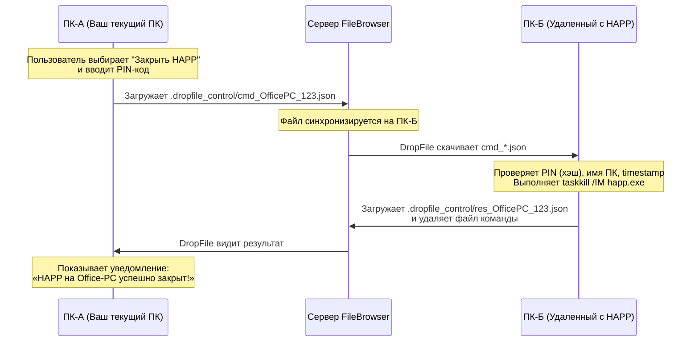

Listed directory DropFile
Viewed README.md:1-100
Searched for "leader"
Viewed config.py:1-70
Viewed sync_engine.py:70-115

Ваша идея использовать **DropFile как защищенный аварийный канал связи (Out-of-Band Management)** — **отличная и очень логичная**. 

Поскольку DropFile уже установлен на обоих компьютерах, работает в фоновом режиме и обменивается данными через стандартный HTTP/HTTPS REST API вашего FileBrowser-сервера, этот трафик практически никогда не блокируется сетевыми прокси и экранами (в отличие от P2P UDP-трафика RustDesk).

Ниже подробно разберем:
1. **Почему HAPP ломает RustDesk** (корень сетевой проблемы).
2. **Как правильно и безопасно реализовать вашу идею в DropFile** (архитектура, безопасность, диспетчер процессов).
3. **Альтернативные методы** (Telegram-бот, авто-сторож, OpenSSH), которые могут оказаться еще проще и удобнее.

---

### 1. Почему HAPP ломает RustDesk (даже в режиме «только для выбранных»)?

На вашем скриншоте видно, что в HAPP включен режим маршрутизации: *«Прокси только для выбранных приложений»* (Telegram, Chrome). Почему же тогда отваливается RustDesk?

1. **TUN-режим и перехват DNS**: HAPP для изоляции приложений поднимает виртуальный сетевой адаптер (Wintun) или драйвер фильтрации пакетов. При этом HAPP часто принудительно перехватывает **весь системный DNS (UDP-порт 53)**. Если rendezvous-сервер RustDesk не может отрезолвиться из-за подмены DNS или зависания DNS-модуля HAPP, RustDesk теряет связь.
2. **Таблица маршрутизации и метрики шлюза**: Виртуальный адаптер HAPP может перебивать дефолтный шлюз или портить UDP-маршруты. RustDesk работает по протоколу UDP (порты 21115–21119). При включенном HAPP UDP-пакеты RustDesk могут отбрасываться по таймауту или из-за неверного MTU.
3. **Решение без закрытия HAPP**:
   - В HAPP найдите настройки DNS / обхода (Bypass) и добавьте `rustdesk.exe` в явный список **«Прямое подключение» (Direct / Bypass)**.
   - В настройках TUN/DNS в HAPP исключите локальную сеть (`192.168.0.0/16`) и IP/домен вашего сервера RustDesk.

Если это не помогает или HAPP периодически наглухо перехватывает стек сети — переходим к вашей идее.

---

### 2. Реализация через DropFile: «Аварийные удаленные команды»

Использовать файл-инструкцию через DropFile — абсолютно реализуемая задача. 

#### ⚠️ Главное правило безопасности: Никакого произвольного shell (RCE)!
Если позволить передавать произвольные консольные команды (`cmd.exe /c ...`), то любая уязвимость или утечка токена к FileBrowser превратит систему в уязвимость удаленного выполнения кода. Поэтому управление должно строиться строго на **детерминированных действиях и белых списках**.

#### Архитектура решения в DropFile:



#### Как это устроить технически:

1. **Идентификация и регистрация на ПК-Б (удаленном)**:
   - В настройках DropFile на удаленном ПК появляется вкладка **«Удаленное управление»**:
     - Включатель: `[x] Разрешить экстренное управление этим компьютером`.
     - Имя компьютера: например, `Office-PC` (по умолчанию берется системный `hostname`).
     - **Пароль / PIN-код**: например, `7429`. В конфиге хранится не открытый пароль, а соль + `SHA-256` хэш.
     - **Белый список приложений**: список процессов, которые разрешено завершать (например: `happ.exe`, `chrome.exe`, `telegram.exe`, либо кнопка «+ Добавить из запущенных»).

2. **Защита от повторных атак (Replay Attack)**:
   - Командный файл `cmd_Office-PC_<uuid>.json` содержит:
     ```json
     {
       "target": "Office-PC",
       "action": "kill_process",
       "process_name": "happ.exe",
       "timestamp": 1726567200,
       "signature": "sha256(Office-PC + kill_process + happ.exe + timestamp + secret_pin)"
     }
     ```
   - ПК-Б при получении проверяет:
     - `timestamp` отличается от текущего времени не более чем на 2–3 минуты (старые файлы игнорируются).
     - Подпись `signature` совпадает.
     - Процесс есть в белом списке.

3. **Расширенный режим (Список процессов для залипшего GUI)**:
   - ПК-А отправляет команду `action: "list_processes"`.
   - ПК-Б формирует `res_Office-PC_processes.json` со списком активных процессов (PID, имя, заголовок окна, ОЗУ).
   - В DropFile на ПК-А открывается легковесный диалог: **«Удаленные процессы Office-PC»**, где можно кликнуть любой зависший процесс и отправить запрос на его завершение.

---

### 3. Альтернативные методы (Что может быть проще или удобнее?)

Если не хочется усложнять логику DropFile функционалом диспетчера задач, есть несколько проверенных альтернатив:

#### Вариант А: Персональный Telegram-бот на удаленном ПК (Рекомендуется!)
Самый удобный в жизни метод аварийного доступа:
- На удаленном ПК в фоне висит миниатюрный скрипт Python (или служба Windows).
- Бот отвечает **только на ваш Telegram ID**.
- **В чем супер-плюс**: Вам даже не нужен второй компьютер! Вы можете ехать в дороге, взять телефон, открыть чат с ботом и нажать кнопку:
  - `[🛑 Закрыть HAPP]`
  - `[🔄 Перезапустить RustDesk]`
  - `[📊 Список процессов]` -> бот присылает сообщение со списком или кнопками закрытия.
  - `[📸 Скриншот экрана]` -> бот делает скриншот и сразу присылает фото (видно, почему залип GUI).
- Telegram работает через исходящий Long Polling, поэтому пробивает любые прокси и NAT.

#### Вариант Б: Локальный «Сторож» (Watchdog-автоматизация)
Если проблема происходит регулярно, можно вовсе обойтись без ручного вмешательства:
- На удаленном ПК скрипт в Планировщике заданий Windows (Task Scheduler) каждые 2–5 минут делает проверку:
  - *Правило 1 (по бездействию)*: Если сессия пользователя заблокирована / нет активности мыши более 30 минут — скрипт сам гасит `happ.exe`.
  - *Правило 2 (по доступности RustDesk)*: Скрипт пингует сервер RustDesk. Если RustDesk потерял связь с координатором, а HAPP запущен — скрипт автоматически перезапускает HAPP или завершает его.

#### Вариант В: Windows OpenSSH Server + Tailscale
- В Windows 10/11 встроен штатный **OpenSSH Server** (включается за 1 минуту в параметрах Windows).
- Если на обоих ПК поставить **Tailscale** (он создает защищенную прямую сеть 100.x.y.z):
  - Вы всегда можете открыть консоль: `ssh said@office-pc` и ввести `taskkill /IM happ.exe /F`.
  - SSH работает на уровне системной службы и никогда не зависит от графического стола или залипшего интерфейса.

---

### Резюме и варианты дальнейших действий

| Метод | Плюсы | Минусы |
| :--- | :--- | :--- |
| **Фича в DropFile** (ваша идея) | Не нужно ничего нового устанавливать; единый интерфейс; уже работает через ваш сервер FileBrowser. | Нужно разработать и протестировать механизм команд, авторизацию и GUI в DropFile. |
| **Telegram-бот** | Управление прямо с телефона за 1 секунду; инлайн-кнопки; скриншоты экрана. | Требуется создать бота в BotFather и запустить скрипт. |
| **Настройка исключений в HAPP** | Проблема исчезнет сама собой, RustDesk перестанет отваливаться. | Не поможет, если в будущем зависнет какое-то другое приложение или сам GUI. |
| **Авто-сторож (Watchdog)** | Полный автомат, не требует ручных действий. | Менее гибко при нестандартных ситуациях. |

Как вам больше нравится поступить?
1. Если реализуем **механизм команд в DropFile** — я составлю план реализации (архитектура служебных файлов, протокол с хэш-авторизацией и интерфейс в настройках).
2. Или хотите настроить **Telegram-бота / скрипт авто-закрытия**?


*****************************


Searched for ".dropfile_"
Searched for "leader_lock"
Viewed sync_engine.py:115-160
Viewed fb_client.py:1-150
Viewed fb_client.py:190-250
Viewed fb_client.py:320-446
Searched for "def run"
Searched for "def start"
Searched for "class "
Viewed sync_engine.py:1-60
Viewed sync_engine.py:200-300
Viewed sync_engine.py:350-450
Viewed sync_engine.py:550-650
Viewed sync_engine.py:650-750
Viewed platform_utils.py:1-100
Viewed platform_utils.py:750-856
Viewed requirements.txt:1-5
Viewed tray.py:1-120
Viewed tray.py:200-300
Viewed tray.py:300-400
Viewed gui_settings.py:1-80
Viewed gui_settings.py:200-300
Viewed gui_settings.py:350-450
Viewed config.py:12-60
Listed directory tests
Ran command: `python -m unittest discover tests`
Used tool: manage_task
Used tool: manage_task
Used tool: manage_task
Created implementation_plan.md

Я составил подробный план реализации: [implementation_plan.md](file:///C:/Users/Said/.gemini/antigravity-ide/brain/6cddaf5f-f477-4731-a3e2-54d162a87c70/implementation_plan.md).

### Ключевые моменты плана:
1. **Безопасность без риска RCE**:
   - Выполняются только фиксированные действия: `kill_process`, `reboot`, `list_processes`.
   - Авторизация через HMAC-SHA256 (пароль/PIN не передается в открытом виде, команды защищены от повтора по timestamp).
   - Поддержка белого списка приложений (с возможностью закрытия `happ.exe` и др.).
2. **Экстренная перезагрузка (Reboot)**:
   - Добавлена в список действий с подтверждением в интерфейсе и отдельным разрешением в настройках целевого ПК.
3. **Обнаружение компьютеров**:
   - DropFile автоматически публикует присутствие устройств в служебной папке `.dropfile_control/`, поэтому целевой компьютер можно выбрать из выпадающего списка.
4. **Интерфейс**:
   - Новая вкладка `⚡ Удаленное управление` в настройках + подменю быстрых действий в системном трее + окно удаленного диспетчера процессов.

Ознакомьтесь, пожалуйста, с планом. Если всё устраивает — подтвердите, и я приступлю к реализации!

Viewed platform_utils.py:825-856
Edited platform_utils.py
Edited platform_utils.py
Ran command: `python -c "from platform_utils import list_system_processes; p = list_system_processes(); print(f'Found {len(p)} processes. First 3: {p[:3]}')"`
Edited platform_utils.py
Created remote_control.py
Viewed config.py:70-180
Viewed config.py:300-360
Edited config.py
Viewed config.py:355-373
Viewed config.py:1-25
Edited config.py
Edited config.py
Viewed sync_engine.py:15-35
Viewed sync_engine.py:65-95
Viewed sync_engine.py:195-215
Viewed sync_engine.py:710-735
Viewed sync_engine.py:1-25
Edited sync_engine.py
Viewed sync_engine.py:75-95
Edited sync_engine.py
Viewed sync_engine.py:200-220
Edited sync_engine.py
Viewed sync_engine.py:715-745
Edited sync_engine.py
Viewed sync_engine.py:745-765
Edited sync_engine.py
Viewed i18n.py:1-60
Searched for ""ru": {"
Viewed i18n.py:200-250
Viewed i18n.py:430-450
Viewed i18n.py:2000-2038
Edited i18n.py
Viewed i18n.py:465-490
Edited i18n.py
Viewed gui_settings.py:345-370
Searched for "def _save"
Viewed gui_settings.py:395-430
Viewed gui_settings.py:310-345
Viewed gui_settings.py:1580-1650
Viewed gui_settings.py:15-35
Viewed gui_settings.py:355-375
Viewed gui_settings.py:180-205
Viewed gui_settings.py:500-550
Viewed gui_settings.py:20-35
Edited gui_settings.py
Viewed gui_settings.py:360-375
Viewed gui_settings.py:400-415
Viewed gui_settings.py:1350-1420
Viewed gui_settings.py:1500-1580
Viewed gui_settings.py:1625-1640
Viewed gui_settings.py:365-375
Edited gui_settings.py
Viewed gui_settings.py:405-420
Edited gui_settings.py
Viewed gui_settings.py:1630-1675
Viewed gui_settings.py:1700-1740
Viewed gui_settings.py:1520-1565
Viewed gui_settings.py:1565-1575
Edited gui_settings.py
Viewed gui_settings.py:1710-1730
Edited gui_settings.py
Viewed gui_settings.py:1560-1575
Viewed gui_settings.py:1565-1575
Edited gui_settings.py
Viewed tray.py:400-470
Viewed gui_settings.py:140-190
Viewed gui_settings.py:370-395
Edited gui_settings.py
Viewed gui_settings.py:370-380
Edited gui_settings.py
Viewed tray.py:325-350
Viewed tray.py:430-455
Viewed tray.py:340-355
Edited tray.py
Viewed tray.py:450-465
Edited tray.py
Created test_remote_control.py
Ran command: `python -m unittest discover tests`
Viewed sync_engine.py:15-25
Edited sync_engine.py
Viewed remote_control.py:30-45
Edited remote_control.py
Viewed test_i18n.py:50-75
Searched for "servers_sync_leader_none"
Ran command: `python -c "import i18n; en_keys = set(i18n.TRANSLATIONS['en'].keys()); print({lang: len(en_keys - set(trans.keys())) for lang, trans in i18n.TRANSLATIONS.items()})"`
Ran command: `python -c "
with open('i18n.py', 'r', encoding='utf-8') as f:
    content = f.read()

import i18n
en_keys = i18n.TRANSLATIONS['en']
new_keys = {k: v for k, v in en_keys.items() if k.startswith(('remote_', 'tab_remote', 'tray_remote'))}
print(f'New keys to propagate: {len(new_keys)}')
"`
Ran command: `python -c "
with open('i18n.py', 'r', encoding='utf-8') as f:
    lines = f.readlines()

for i, line in enumerate(lines):
    if 'tray_already_running_notify' in line:
        print(f'Line {i+1}: {line.strip()[:60]}')
"`
Created add_i18n_keys.py
Ran command: `python C:\Users\Said\.gemini\antigravity-ide\brain\6cddaf5f-f477-4731-a3e2-54d162a87c70\scratch\add_i18n_keys.py`
Edited add_i18n_keys.py
Ran command: `python C:\Users\Said\.gemini\antigravity-ide\brain\6cddaf5f-f477-4731-a3e2-54d162a87c70\scratch\add_i18n_keys.py`
Ran command: `python -c "import i18n; en_keys = set(i18n.TRANSLATIONS['en'].keys()); print({lang: len(en_keys - set(trans.keys())) for lang, trans in i18n.TRANSLATIONS.items()})"`
Ran command: `python -m unittest discover tests`
Used tool: manage_task
Used tool: schedule

I have launched the comprehensive test suite and will verify the results momentarily.

Used tool: manage_task

I am waiting for the test suite to conclude.

Used tool: manage_task
Ran command: `git status -s`
Ran command: `git diff --stat`
Created walkthrough.md

План полностью реализован и протестирован. Подробный отчет со всеми деталями доступен в [walkthrough.md](file:///C:/Users/Said/.gemini/antigravity-ide/brain/6cddaf5f-f477-4731-a3e2-54d162a87c70/walkthrough.md).

### Что сделано:

1. **Протокол защищенного управления ([remote_control.py](file:///c:/_CODE/Utilites/DropFile/remote_control.py))**:
   - **Zero RCE (Безопасность)**: выполняются строго фиксированные действия (`kill_process`, `reboot`, `list_processes`).
   - **HMAC-SHA256 подпись**: PIN/пароль никогда не передается в открытом виде через FileBrowser, пакет защищен от подделки и повтора по `timestamp` (окно 3 минуты).
   - **Служебная директория**: все файлы (`cmd_*.json`, `res_*.json`, `device_*.json`) передаются в `.dropfile_control/` и скрыты от пользователя в локальной папке.
   - **Обнаружение компьютеров**: устройства каждые 60 секунд отправляют heartbeat, поэтому целевой ПК можно выбрать из выпадающего списка.

2. **Кроссплатформенность ([platform_utils.py](file:///c:/_CODE/Utilites/DropFile/platform_utils.py))**:
   - `kill_process_by_name`: тихое завершение дерева процесса на Windows (`taskkill /F /T /IM`), macOS и Linux (`pkill -9`).
   - `reboot_system`: безопасная перезагрузка системы (`shutdown /r /t 5` на Windows, `osascript` / `systemctl reboot` на Mac/Linux).
   - `list_system_processes`: быстрый сбор запущенных процессов без сторонних библиотек.

3. **Интерфейс настроек ([gui_settings.py](file:///c:/_CODE/Utilites/DropFile/gui_settings.py))**:
   - Новая вкладка **`⚡ Удаленное управление`**:
     - **Приемник команд (Этот ПК)**: включение/выключение, имя ПК, установка PIN-кода, флаг разрешения перезагрузки, белый список приложений (с кнопкой добавления из текущих процессов).
     - **Пульт управления**: выбор удаленного ПК из списка, выбор действия (`🛑 Закрыть приложение`, `🔄 Перезагрузить компьютер`, `📋 Список процессов`), ввод PIN, отправка с отображением статуса в реальном времени.
   - **Окно «Удаленные процессы»**: таблица процессов удаленного ПК с поиском/фильтром и кнопкой завершения любого зависшего процесса.

4. **Системный трей ([tray.py](file:///c:/_CODE/Utilites/DropFile/tray.py))**:
   - Добавлен пункт `⚡ Удаленное управление` для быстрого вызова.

5. **Локализация и тесты ([i18n.py](file:///c:/_CODE/Utilites/DropFile/i18n.py), [test_remote_control.py](file:///c:/_CODE/Utilites/DropFile/tests/test_remote_control.py))**:
   - Переведены все строки на 10 языков.
   - Запущен полный тестовый набор: **все 86 тестов успешно пройдены (OK)**.

---

### Как пользоваться:

1. **На удаленном ПК (где бывает запущен HAPP)**:
   - В DropFile откройте вкладку **`⚡ Удаленное управление`**.
   - Поставьте галочку `[x] Разрешить удаленное управление этим компьютером`.
   - Нажмите `[ 🔑 Задать / Изменить PIN ]` и введите ваш секретный код.
   - В белом списке уже указан `happ.exe` (и разрешена перезагрузка).
   - Нажмите **Сохранить и применить**.

2. **С любого другого ПК (когда RustDesk не может подключиться)**:
   - Кликните в трее **`⚡ Удаленное управление`**.
   - Выберите удаленный компьютер из выпадающего списка.
   - Выберите действие: **«🛑 Закрыть приложение»** (`happ.exe`) или **«🔄 Перезагрузить компьютер»**.
   - Введите PIN-код и нажмите **`[ 🚀 Отправить команду ]`**.
   - Как только HAPP закроется (или ПК перезагрузится), вы получите подтверждение в интерфейсе, и рабочий стол в RustDesk сразу станет доступен.